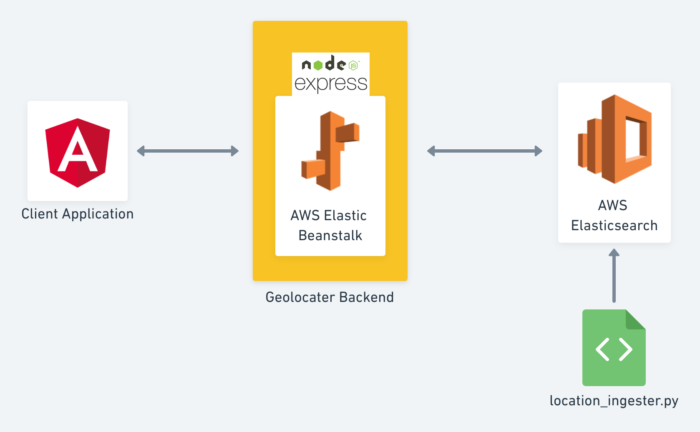

# Geolocator Project
## Project Function:
When user provides a (readable) address, it returns all locations within a certain range of the input from a predefined set of addresses. 

## Project Architecture:
:

### Database:
Used a Python script to parse and load the given addresses; temporary measure and not recommended as a permanent solution.
Used fault tolerant, distributed, search engine like Elasticsearch to store and retrieve set of addresses 

### Back-end:
Utilizes ExpressJS, AWS Beanstalk and Elasticsearch, Docker, and OpenCage Geocoder.
An Express JS server that is deployed on AWS Beanstalk utilizing Docker was built.
The Opencage Geocoder API is used for converting the user input into latitude and longitude coordinates.
An Elasticsearch connector to query the database based on lat., long., and range was written. It returns the result in sorted order of closest points first.

### Front-end:
Utilizes Angular v8.
Input address sends a post request to AWS Beanstalk, and after back-end does its job (as described above), the coordinates (latitude and longitude) are converted into an address.

## Further implementations:

Build an automated mechanism to load addresses to database.

Dynamically display the addresses based on the area zoomed.

